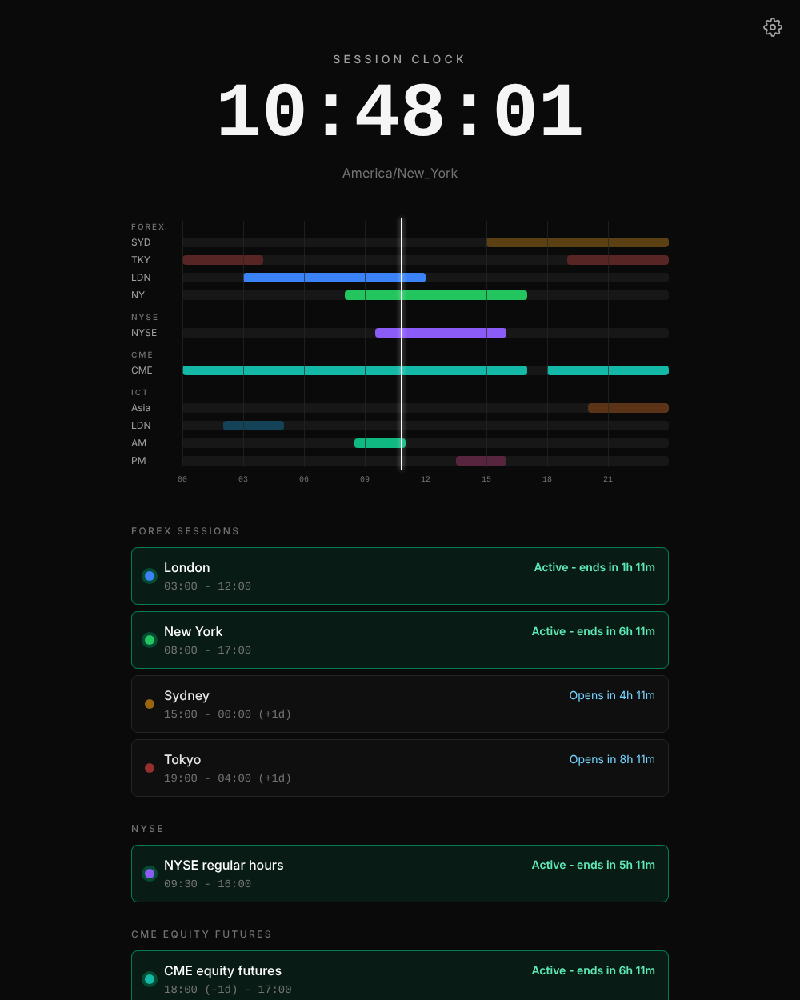

# Session Clock

[](https://github.com/latiryni-gilbert/session-clock/actions/workflows/ci.yml)

A web app that shows which trading sessions are open right now, and when the next ones open, in your local time.

**Live: [sessionclock.vercel.app](https://sessionclock.vercel.app/)**



## Features

- **Clock** with your detected time zone.
- **24-hour timeline** for your local day, with a moving "now" line. Overnight sessions are split at midnight, and active sessions are brighter.
- **Session list with live status:** "Active - ends in 1h 12m", "Opens in 3h 05m", or "Opens Sun 18:00" when the next open is more than a day away. Active sessions come first.
- **Presets:** Forex (Sydney, Tokyo, London, New York), NYSE regular hours, CME equity futures, and ICT killzones (Asian, London, New York AM, New York PM).
- **Custom windows:** add, edit and delete your own, each with its own time zone, days and color. Show or hide any window or group.
- **In-page alerts:** get a banner (and a quiet chime) 5, 15 or 30 minutes before a window opens. If the page was asleep, it catches up when you come back.
- **Desktop notifications:** optional, and only asked for when you turn them on. They are sent when the tab is in the background.

## Time zones and daylight saving

Every window is defined in its own home time zone (the London session is 08:00 to 17:00 London time) and converted to your browser's zone for the specific date, using Luxon. Daylight-saving changes in either place are therefore handled automatically, and a start time that falls in a spring-forward gap moves to the next valid time. A window that ends before it starts runs past midnight and belongs to the day it starts on.

## Tech stack

React, TypeScript, Vite, Tailwind CSS, Luxon, Vitest, GitHub Actions (CI), and Vercel (hosting).

## Run it locally

You need Node 22 (see `.nvmrc`).

```bash
git clone https://github.com/latiryni-gilbert/session-clock.git
cd session-clock
npm ci
npm run dev
```

Then open the address Vite prints (usually http://localhost:5173).

Other commands:

```bash
npm test         # run the tests once
npm run lint     # lint
npx tsc -b       # type check
npm run build    # production build into dist/
```

## Limitations

- **Alerts only work while the page is open.** There is no background service, so a closed tab means no alert.
- **Preset times are common conventions** and may differ from your source. Check them against your broker or exchange.
- **No holiday calendar:** exchange holidays and early closes are not modeled.
- **Desktop notifications aren't available everywhere:** not on Android Chrome, and not on iPhone Safari outside a Home Screen app. In-page alerts still work there.
- Settings and custom windows are saved in your browser only, so they don't sync between devices.

## Built with AI-assisted development

This project was built with AI-assisted development using [Claude Code](https://claude.com/claude-code).
